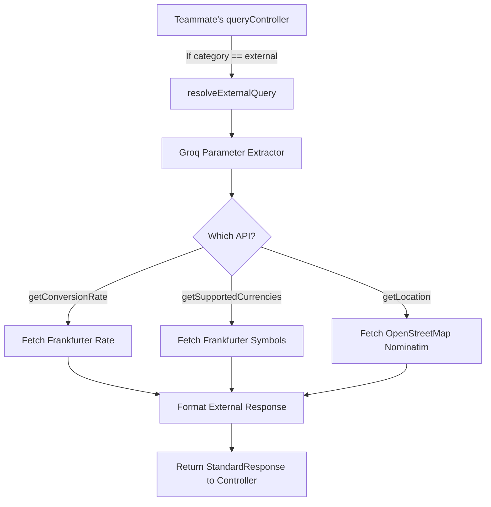

# Implementation Plan: External API Query Execution (TypeScript)

This plan outlines the implementation for the **External API** query execution engine. It aligns with the design where a teammate's controller ([queryController.ts](file:///Volumes/Sieam's%20SSD/BUET_Hackathon_2025/bcf-2026-hackathon-preliminary/backend/src/controllers/queryController.ts)) first determines if the question category is `"external"`, and then hands off processing to our external execution services.

---

## 📂 Architecture & Integration Flow

When the controller identifies that `category === "external"`, it calls our module:



---

## ⚡ Implementation Details & Code Skeletons

### 1. External Resolver Interface (`src/services/external/index.ts`)
This acts as the entry point that `queryController.ts` invokes.

```typescript
import { getConversionRate, getSupportedCurrencies } from './currency.js';
import { getLocationCoordinates } from './geocode.js';
import { generateGroqResponse } from '../llm/groqClient.js';
import { formatExternalResponse, StandardResponse } from '../response/formatter.js';

interface ExtractorResponse {
  api: 'getConversionRate' | 'getSupportedCurrencies' | 'getLocation';
  params?: any;
}

export async function resolveExternalQuery(
  question: string,
  llm: string
): Promise<StandardResponse> {
  // Step 1: Extract specific API and parameters using Groq JSON mode
  const systemPrompt = `
  You are an API parameter extractor. Your task is to identify which external API to call to answer the question, and extract the parameters.
  
  Available APIs:
  1. getConversionRate:
     - Returns exchange rates.
     - Parameters: 'base' (string, e.g. "EUR"), 'symbols' (string, comma-separated targets e.g. "USD"), 'date' (optional historical date YYYY-MM-DD, e.g. "2024-01-15").
  2. getSupportedCurrencies:
     - Returns supported currency names. Use when asking about currency symbols (e.g., 'CHF') or total supported currencies.
     - Parameters: None.
  3. getLocation:
     - Returns latitude/longitude coordinates.
     - Parameters: 'q' (location search string, e.g., "Denver, Colorado").

  Format output as a JSON object:
  {
    "api": "getConversionRate" | "getSupportedCurrencies" | "getLocation",
    "params": { ... }
  }
  `;

  const extractionText = await generateGroqResponse(
    `Extract parameters for: "${question}"`,
    systemPrompt
  );
  
  const callDetails: ExtractorResponse = JSON.parse(extractionText);
  let data: any;

  // Step 2: Execute API call
  if (callDetails.api === 'getConversionRate') {
    data = await getConversionRate(callDetails.params);
  } else if (callDetails.api === 'getSupportedCurrencies') {
    data = await getSupportedCurrencies();
  } else if (callDetails.api === 'getLocation') {
    data = await getLocationCoordinates(callDetails.params);
  } else {
    throw new Error(`Unsupported API: ${callDetails.api}`);
  }

  // Step 3: Format the response to fit the checker structure
  return formatExternalResponse(question, llm, callDetails.api, data);
}
```

---

### 2. Frankfurter Currency Client (`src/services/external/currency.ts`)
Handles network requests to Frankfurter.

```typescript
export interface ConversionParams {
  base?: string;
  symbols?: string;
  date?: string;
}

export async function getConversionRate(params: ConversionParams = {}): Promise<any> {
  const base = params.base || 'EUR';
  const symbols = params.symbols || 'USD';
  const date = params.date && params.date !== 'latest' ? params.date : 'latest';
  
  const url = `https://api.frankfurter.dev/v1/${date}?base=${base}&symbols=${symbols}`;
  const response = await fetch(url);
  if (!response.ok) {
    throw new Error(`Frankfurter API returned status ${response.status}`);
  }
  return await response.json();
}

export async function getSupportedCurrencies(): Promise<Record<string, string>> {
  const url = 'https://api.frankfurter.dev/v1/currencies';
  const response = await fetch(url);
  if (!response.ok) {
    throw new Error(`Frankfurter API returned status ${response.status}`);
  }
  return await response.json();
}
```

---

### 3. Nominatim Geocoding Client (`src/services/external/geocode.ts`)
Queries coordinate endpoints with correct User-Agent headers.

```typescript
export interface LocationParams {
  q: string;
}

export async function getLocationCoordinates(params: LocationParams): Promise<any> {
  if (!params.q) {
    throw new Error("Geocoding query parameter 'q' is required");
  }
  
  const url = `https://nominatim.openstreetmap.org/search?q=${encodeURIComponent(params.q)}&format=json`;
  
  const response = await fetch(url, {
    headers: {
      'User-Agent': 'ConversationalDBEngine/1.0 (hackathon-preliminary@buet.edu)'
    }
  });
  if (!response.ok) {
    throw new Error(`Nominatim API returned status ${response.status}`);
  }
  return await response.json();
}
```

---

### 4. Response Formatter (`src/services/response/formatter.ts`)
Converts raw responses to standard columns and rows matching expected values.

```typescript
export interface StandardResponse {
  question: string;
  llm: string;
  result_type: 'scalar' | 'record' | 'table';
  columns: string[];
  rows: any[][];
  meta: {
    row_count: number;
    source: 'external' | 'database' | 'mixed';
  };
}

export function formatExternalResponse(
  question: string,
  llm: string,
  api: string,
  data: any
): StandardResponse {
  let result_type: 'scalar' | 'record' | 'table' = 'scalar';
  let columns: string[] = [];
  let rows: any[][] = [];

  if (api === 'getConversionRate') {
    const symbolKeys = Object.keys(data.rates || {});
    const rateVal = symbolKeys.length > 0 ? data.rates[symbolKeys[0]] : null;
    
    result_type = 'scalar';
    columns = ['rate'];
    rows = [[rateVal]];
    
  } else if (api === 'getSupportedCurrencies') {
    if (question.toLowerCase().includes('how many')) {
      const count = Object.keys(data).length;
      result_type = 'scalar';
      columns = ['supported_currencies_count'];
      rows = [[count]];
    } else {
      const match = question.match(/'([^']+)'/);
      const symbol = match ? match[1].toUpperCase() : 'CHF';
      const name = data[symbol] || null;
      
      result_type = 'scalar';
      columns = ['currency_name'];
      rows = [[name]];
    }
    
  } else if (api === 'getLocation') {
    const item = Array.isArray(data) && data.length > 0 ? data[0] : null;
    if (!item) {
      throw new Error("No location coordinates found");
    }
    
    const isLat = question.toLowerCase().includes('latitude');
    const isLon = question.toLowerCase().includes('longitude');
    
    if (isLat && !isLon) {
      result_type = 'scalar';
      columns = ['lat'];
      rows = [[parseFloat(item.lat)]];
    } else if (isLon && !isLat) {
      result_type = 'scalar';
      columns = ['lon'];
      rows = [[parseFloat(item.lon)]];
    } else {
      result_type = 'record';
      columns = ['lat', 'lon'];
      rows = [[parseFloat(item.lat), parseFloat(item.lon)]];
    }
  }

  return {
    question,
    llm,
    result_type,
    columns,
    rows,
    meta: {
      row_count: rows.length,
      source: 'external'
    }
  };
}
```
