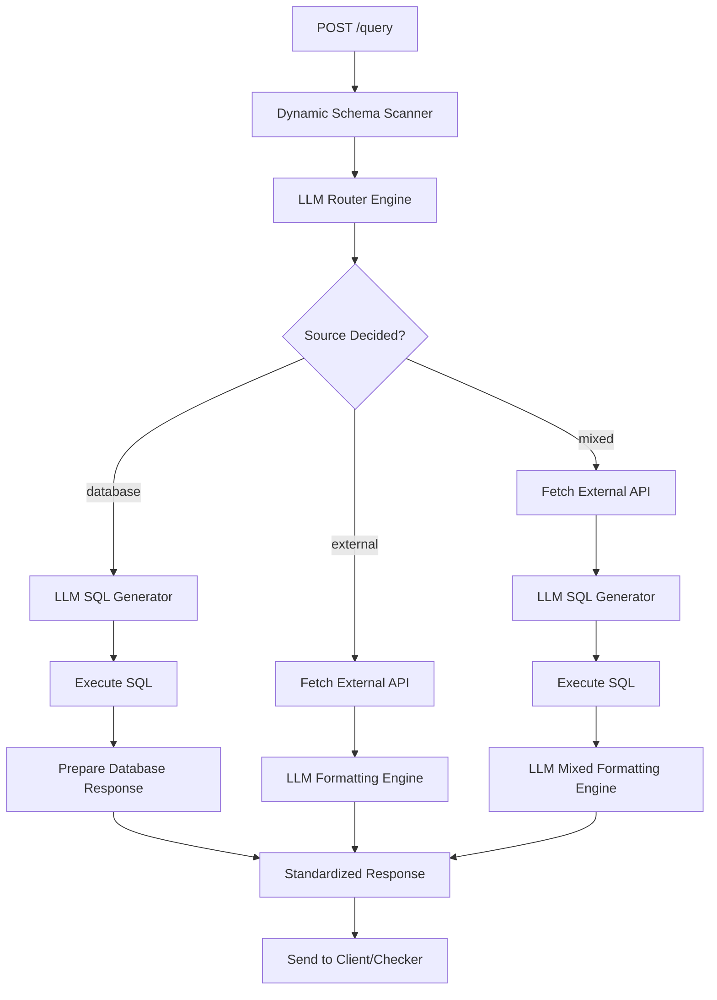

# Flawless Execution Plan: ConversationalDB Natural Language Query Engine

This document outlines the architecture, data structures, and implementation steps to build the ConversationalDB backend. It is designed to be 100% database-agnostic, handle database queries, external API calls, and mixed scenarios seamlessly, and complete execution rapidly.

---

## 🛠️ Technology Stack & Dependencies

We will use **Node.js** for the backend because it starts instantly, has native async support for fetching APIs and querying PostgreSQL, and handles JSON natively.

- **Runtime**: Node.js (v25+)
- **Framework**: Express (minimal, fast routing)
- **Database Driver**: `pg` (node-postgres for robust Postgres connections)
- **LLM Client**: `@google/generative-ai` (official Gemini API SDK)
- **Environment**: `dotenv` (management of credentials)
- **HTTP Client**: Built-in global `fetch`

---

## 📐 Architecture & Logic Flow



---

## ⚡ Key Implementation Components

### 1. Dynamic Schema Scanner (100% Database-Agnostic)
Instead of hardcoding table names or columns, the backend queries Postgres catalog tables on startup (or per request, with local caching) to build the active schema representation.

- **Query tables and columns**:
  ```sql
  SELECT 
    t.table_name,
    c.column_name,
    c.data_type
  FROM information_schema.tables t
  JOIN information_schema.columns c ON t.table_name = c.table_name
  WHERE t.table_schema = 'public'
  ORDER BY t.table_name, c.ordinal_position;
  ```
- **Query foreign keys (relationships)**:
  ```sql
  SELECT
    tc.table_name AS foreign_table,
    kcu.column_name AS foreign_column,
    ccu.table_name AS primary_table,
    ccu.column_name AS primary_column
  FROM information_schema.table_constraints AS tc
  JOIN information_schema.key_column_usage AS kcu ON tc.constraint_name = kcu.constraint_name AND tc.table_schema = kcu.table_schema
  JOIN information_schema.constraint_column_usage AS ccu ON ccu.constraint_name = tc.constraint_name AND ccu.table_schema = tc.table_schema
  WHERE tc.constraint_type = 'FOREIGN KEY' AND tc.table_schema = 'public';
  ```
- The backend serializes this dynamically fetched metadata into a clean text prompt (e.g. `Table: employees (id, name, manager_id FK to employees.id)`) and appends it to SQL generation prompts.

### 2. Intelligent Dynamic Router Engine
A structured LLM request evaluates whether the question requires the database, an external API, or both.

- **Input Prompt**: The user's question + OpenAPI definitions.
- **Expected Output JSON**:
  ```json
  {
    "source": "database" | "external" | "mixed",
    "external_calls": [
      {
        "api": "getConversionRate" | "getSupportedCurrencies" | "getLocation",
        "params": {
          "base": "EUR",
          "symbols": "USD",
          "date": "2024-01-15",
          "q": "Dhaka"
        }
      }
    ],
    "db_query_needed": true | false,
    "db_query_instruction": "Prompt text for SQL generator if mixed"
  }
  ```

### 3. SQL Generator with Result-Type Prediction
For database operations, the LLM receives the schema, the question/instruction, and any external API context. It generates both the PostgreSQL query and predicts the correct `result_type` (`scalar`, `record`, `table`).

- **Expected Output JSON**:
  ```json
  {
    "sql": "SELECT ...",
    "result_type": "scalar" | "record" | "table"
  }
  ```
- **Execution**: The server executes the raw SQL directly on PostgreSQL, maps results to standard columns/rows arrays, and formats appropriately.

### 4. External / Mixed Response Formatter
For queries containing external components, the LLM maps raw responses to the required structure:
```json
{
  "result_type": "scalar" | "record" | "table",
  "columns": ["col_name"],
  "rows": [[value]]
}
```
This guarantees perfect layout matching without custom procedural parsers for every question type.

---

## 🚀 Execution & Implementation Steps

### Step 1: Initialize the Project & Install Dependencies
Initialize a Node.js project in `backend/` and install the required packages.
1. Declare `"type": "module"` in `package.json`.
2. Install `express`, `pg`, `@google/generative-ai`, and `dotenv`.

### Step 2: Configure Environment Variables
Copy `.env.example` to `.env` and fill in:
- DB connection configurations (pointing to port 5433 for local Docker).
- `GEMINI_API_KEY`.
- `PORT` (8080).

### Step 3: Implement components
Write the script files:
- `schema.js`: Dynamic postgres schema generator.
- `external.js`: Integration clients for Frankfurter and Nominatim.
- `gemini.js`: Gemini client wrappers for planning, SQL generation, and result mapping.
- `index.js`: Express endpoints (`/health` and `/query`).

### Step 4: Configure `hackathon.yml`
Copy `hackathon.yml.templates/hackathon.node.template.yml` to the root `hackathon.yml` file.

### Step 5: Run and Verify
1. Start Express: `npm start` (or `node index.js`).
2. Run the checker: `python3 checker/checker.py -b http://localhost:8080`.
3. Fix potential edge cases (e.g. currency rate dates formats, case differences, etc.).

